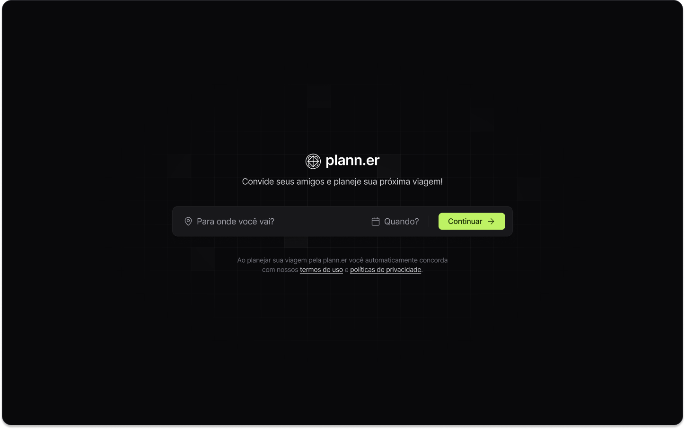

<p align="center">
  
</p>

<p align="center">
  Aplicação desenvolvida no NLW Journey da Rocketseat na trilha React. 
</p>

<p align="center">
  <a href="#-tecnologias">Tecnologias</a>&nbsp;&nbsp;&nbsp;|&nbsp;&nbsp;&nbsp;
  <a href="#-projeto">Projeto</a>&nbsp;&nbsp;&nbsp;|&nbsp;&nbsp;&nbsp;
  <a href="#-layout">Layout</a>
</p>

<br>

<p align="center">
  
</p>

## 🛠️ Tecnologias

Esse projeto foi desenvolvido com as seguintes tecnologias:

- TypeScript
- React
- Tailwind
- Tailwind Variants
- Axios
- React Day Picker
- Date-fns

## 🚀 Projeto

Nesse projeto iremos criar um aplicativo de planejamento de viagens, A ferramenta permite cadastrar viagens, convidar amigos, criar atividades nessa viagem e muito mais. Este projeto consome a API desenvolvida na trilha de Node.js

O back-end da aplicação está disponível neste repositório: **nlw-journey-nodejs**. Certifique-se de rodá-lo para que a aplicação front-end funcione corretamente.

## :clipboard: Clonando o repositório Back-end:
```sh
  git clone https://github.com/JuniorLima36/nlw-journey-nodejs.git
```

### ▶️ Rodando Front-end e Back-end:
```sh
  npm install
  npm run dev
```